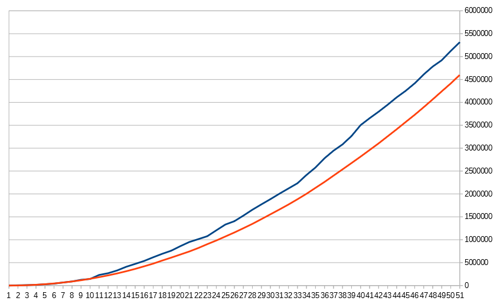

Benchmarks
==========

`fnv-plus` was benchmarked against several node modules which also calculate
FNV hashes. It was laso compared with previous version to see difference
between optimized and `jsbn` based implementations. For full report see
[bench.txt](bench.txt). You can also run benchmark by `node bench.js`.

At the moment fnv-plus is fastest for 32bits

    Benchmarking: fnv_1a 32bit hashes as HEX (in ops/sec)
        node-hashes   :  1,157,886
        fnv           :    575,333
        fnv32         :    877,245
        dding-fnv     :  1,775,033
        fnv1a         :  1,699,150
        fnv+ old      :  1,160,241
        fnv+ new      :  3,234,274
        fnv+ fast     :  4,513,486
    ---------------------------------
    Fastest is "fnv+ fast".

Note: `node-hashes` is native module written in C.

And for 64bit (but `dding-fnv` is the one other module supporting 64bit though...)

    Benchmarking: fnv_1a 64bit hashes (in ops/sec)
        dding-fnv     :        194
        fnv+ old      :     24,876
        fnv+ new      :  3,984,470
        fnv+ fast     :  5,364,450
        fnv+ old 52   :     11,725
        fnv+ new 52   :  5,320,931
        fnv+ fast 52  :  8,092,374
    ---------------------------------
    Fastest is "fnv+ fast 52".

Here you can see also 52bit functions. And for some reason they are even
faster thatn 32bit! I can't explain this. Looks like some fancy v8
optimizations.

Other bitsizes was only in `fnv-plus` and now they runs 100 times faster.

## Lib-overhead

Nice API, useful options, checks for valid input - all this add to run costs.
Here you can see how it affects 52bit variant of hash.

    Benchmarking: fnv+ 1a 52bit hash (in ops/sec)
        hex convert   :  1,240,115      value: "9d30437a43ec0"
        str convert   :  1,507,729      value: "r87omfbw74"
        dec value     :  3,867,264      value: "2765289857236672"
        value.toString:  4,642,657      value: "2765289857236672"
        direct value  :  5,436,712      value: 2765289857236672
        fnv+ fast hex :  5,490,929      value: "9d30437a43ec0"
        fnv+ fast     :  8,078,344      value: 2765289857236672
    ---------------------------------
    Fastest is "fnv+ fast".

Fast function does not convert hash to hex or dec strings, has hardcoded seed
and provides only 1a variant of the algorithm. It also returns calculated
value directly. All this makes it 6 times faster than hex variant of the
function.

But from other hand all this is valid for case when you hash short string.
Here even native implementations are slower than pure JS. Because there is
aditional overhead for calling native function.

But if you want to hash really big strings, then *lib-overhead* does not
matter much. And native modules are fastest one.

    Benchmarking: fnv_1a 32bit hashes as INT (in ops/sec)
        node-hashes   :        338
        fnv           :         66.06
        fnv32         :        110
        dding-fnv     :        129
        fnv1a         :        121
        fnv+ old      :         78.93
        fnv+ new      :        165
        fnv+ fast     :        165
    ---------------------------------
    Fastest is "node-hashes".

## UTF-8 and binary strings

Currently `fnv-plus` implemented for binary strings. For handling UTF-8
strings implementation must be extended with checks for `charCode` value. This
will be additional overhead. But is this really important?

I did collizions test wiht 32, 52 and 64 bit versions of FNV. Test was
performed for 200,000,000 unique short strings. Full report see in
[utfbench.txt](utfbench.txt). You can also run benchmark by
`node utfbench.js`.

#### Results:

 - binary 32bit fnv_1a had 5,312,923 collisions (2.656%)
 - UTF-8 32bit fnv_1a had 4,599,880 collisions (2.3%)

I think what having 0.356% less collisions by sacrificing execution speed does
not worth it. This hash function is not secure and does not guerantee good
collisions resistance, so when we use it we already expect a lot of
collisions, so why bother?

But it was interesting to see how amount of collisions grow over time for this
two functions:

For 52 and 64 bit variants results are:

 - binary 52bit fnv_1a had 12 collisions
 - UTF-8 52bit fnv_1a had 6 collisions
 - binary 64bit fnv_1a had no collisions
 - UTF-8 64bit fnv_1a had 4 collisions

200,000,000 samples are not enough here. So we can't tell how this will grow further. But results for 64bit version is quite interesting (or maybe all this is just false positives from Bloom filter?).
